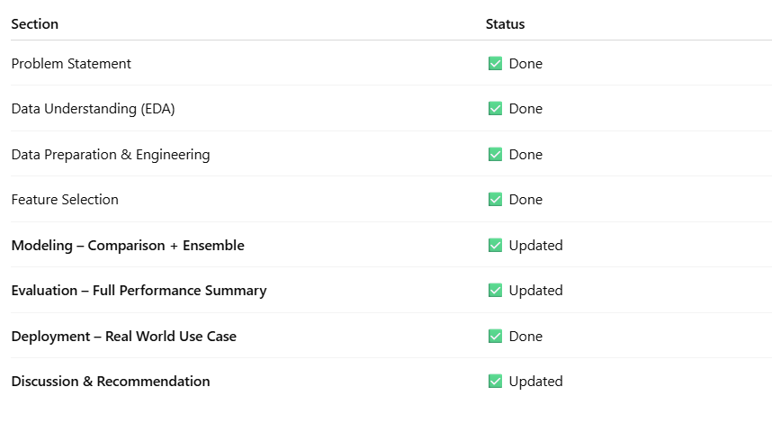
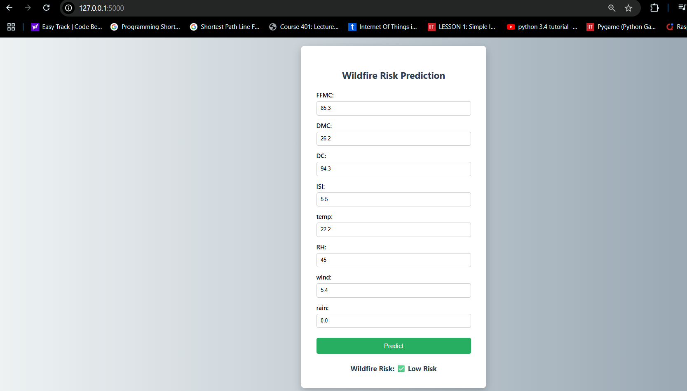

# 🔥 Wildfire Risk Prediction Using Environmental and Weather Data

**University**: University of San Diego  
**Course**: AAI 510 – Fundamentals of Machine Learning  
**Group**: USD AAI 510 – Group 9  

**Team Members**:  
- 👨‍💼 Rishabh Pathak (Group Leader)  
- 👨‍🔬 Arunkumar Rajaganapathy  
- 👨‍💻 Balaji Rao

---

## 📘 Overview

This project predicts the **likelihood of wildfire occurrence** using weather and environmental features from the **UCI Forest Fires Dataset**. The solution includes:

- A **Jupyter Notebook** for data preprocessing, model training, and evaluation  
- A **Flask Web App** that allows users to input weather parameters and receive fire risk predictions

---

## 📁 Project Structure

```
WildFire-Risk-Prediction-AAI-510/
│
├── wildfire_model.pkl                      ← Trained ML model
├── app.py                                  ← Flask backend application
├── templates/
│   └── index.html                           ← Web UI for prediction
├── Final-Project-USD-AAI-510-GROUP-9.ipynb  ← Full ML notebook
├── Final-Project-USD-AAI-510-GROUP-9.html   ← Full ML notebook HTML File
├── Final-Project-USD-AAI-510-GROUP-9.pdf    ← Full ML notebook PDF File
└── README.md                                ← This file
```

---

## 📊 Jupyter Notebook Highlights (`Final-Project-USD-AAI-510-GROUP-9.ipynb`)

### 1. 📌 Problem Statement
Build a model that predicts wildfire risk using weather-related data to support early warning systems and resource allocation.

### 2. 🔍 Exploratory Data Analysis
- Converted the `area` field into binary `fire` (1 = fire occurred, 0 = no fire)
- Visualized class distribution and continuous feature distributions

### 3. 🛠️ Feature Engineering
- Focused only on 8 numeric features for deployment simplicity:
  - `FFMC`, `DMC`, `DC`, `ISI`, `temp`, `RH`, `wind`, `rain`
- Removed categorical and geographic features for UI compatibility

### 4. 🧠 Model Building
- Used `RandomForestClassifier`
- Train-test split with stratification
- Evaluated using AUC, precision, recall, accuracy
- Saved model using `joblib` as `wildfire_model.pkl`

*The Notebook covers the following -*
  
---

## 🌐 Flask Web App

A lightweight web interface built with Flask that lets users enter weather features and receive wildfire risk prediction.

### 🔧 Features
- Clean UI built with HTML + CSS
- Takes 8 weather parameters as input
- Displays prediction: 🔥 High Risk or ✅ Low Risk
- Local deployment for demo purposes

---

## 🚀 How to Use

### 📦 Step 1: Install Requirements

```bash
pip install flask pandas scikit-learn joblib
```

### ▶️ Step 2: Run the Web App

```bash
python app.py
```

### 🌐 Step 3: Open in Browser

Go to: [http://127.0.0.1:5000](http://127.0.0.1:5000)

---

## 📸 Web App Screenshot

  
*Sample Output: Wildfire Risk: ✅ Low Risk*

---

## ✅ Technologies Used

- **Python**
- **Pandas**, **Scikit-learn** (ML & preprocessing)
- **Matplotlib**, **Seaborn** (visualizations)
- **Flask** (web framework)
- **Joblib** (model serialization)

---

## 📌 Learning Outcomes

- Full end-to-end ML project development experience
- Hands-on practice with model training, evaluation, and deployment
- Built a real-time ML-powered web interface
- Understood importance of clean UI and input–model consistency

---

## 📄 License

This project is created for educational purposes under the University of San Diego AAI 510 course.

---

